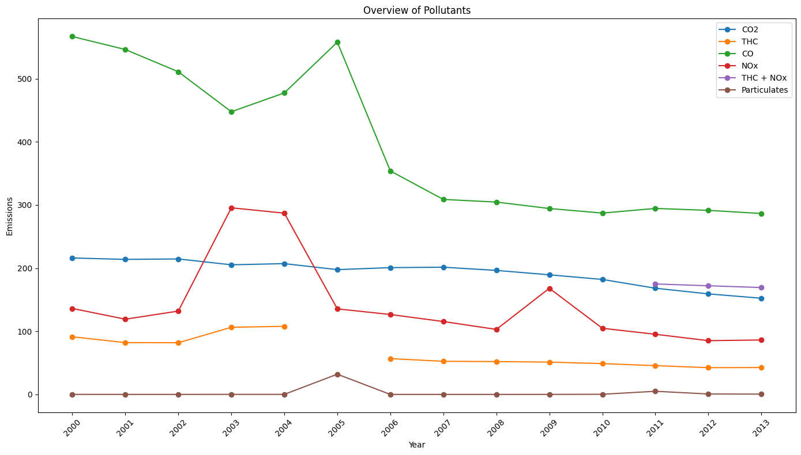
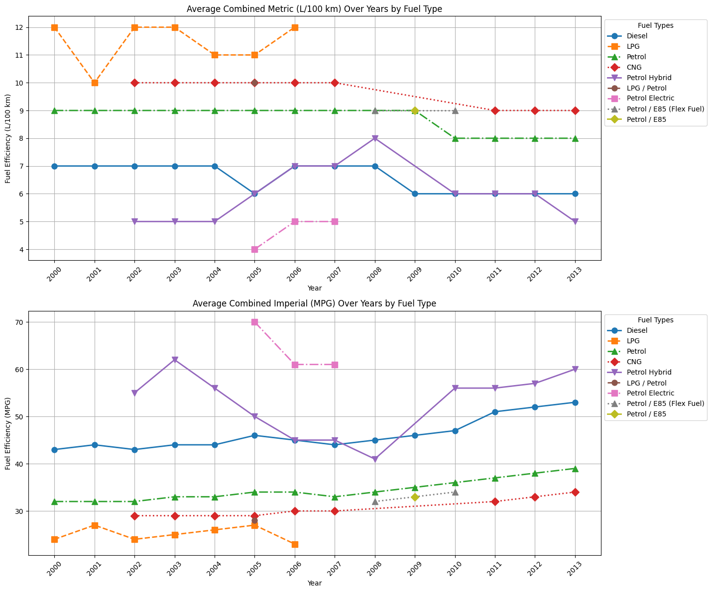
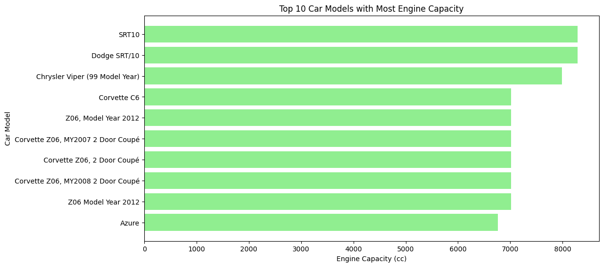
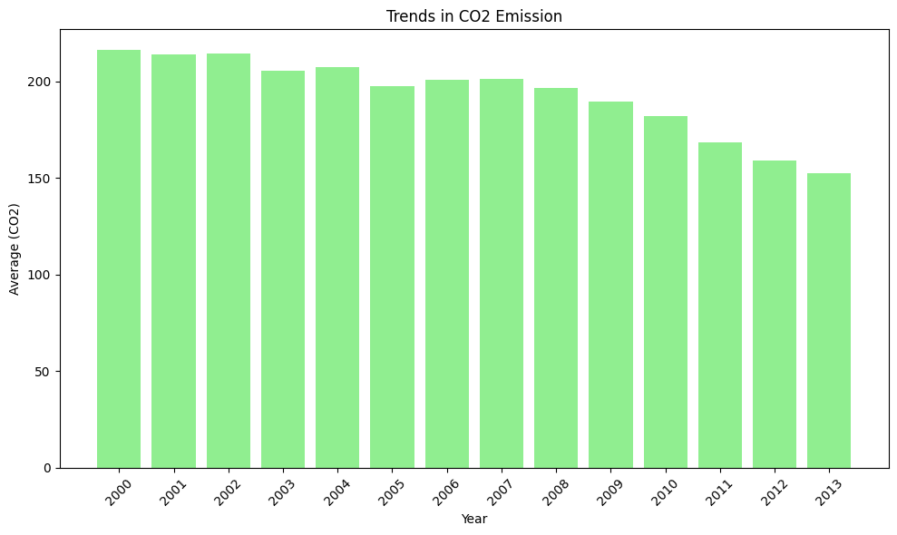
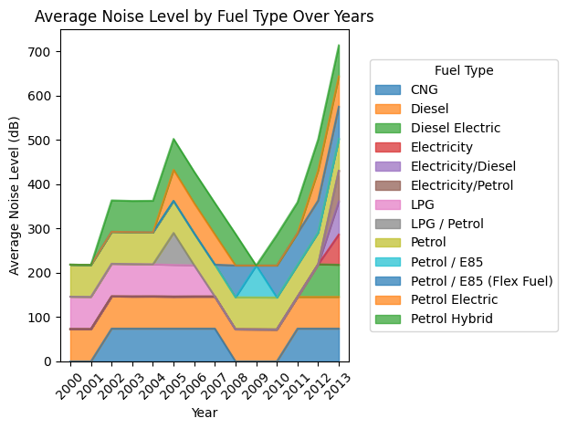

# Introduction
This project delves into the car fuel dataset, uncovering key trends in emissions, fuel efficiency, engine capacities, and noise levels across different fuel types from 2000 to 2013. By visualizing these metrics, it highlights the evolving landscape of automotive performance and environmental impact, offering valuable insights into the transition towards cleaner and more efficient vehicles.

Original Dataset: [Access Now](https://www.kaggle.com/datasets/mohameds10960/car-fuel-and-emissions-2000-2013/data)

Credits: [Mohamed Sameh](https://www.kaggle.com/mohameds10960)

# Background
Driven by the need to better understand trends in vehicle performance and environmental impact, this project aims to provide insights into various aspects of automotive data. By exploring noise levels, emissions, fuel efficiency, and engine capacities, the project seeks to uncover patterns and inform better decision-making in the automotive industry.

The questions addressed through SQL queries include:

1. What are the trends in pollutants emissions between the years 2000-2013?

2. How does fuel efficiency trend over time across different engine types?

3. What are the top car models with the highest engine capacity (in cc)?

4. What are the trends in CO2 emissions over the years?

5. How has the yearly average noise level varied across different fuel types?

# Tools I Used
For my deep dive to better understand trends in vehicle performance and environmental impact, I harnessed the power of several key tools:

- **SQL:** Utilized for querying and managing the dataset, extracting insights and patterns efficiently.
- **Python:** Applied for data analysis, visualization, and scripting to enhance the insights drawn from the data.
- **PostgreSQL:** Employed as the database management system to handle and process the dataset.
- **Visual Studio Code:** Used as the primary code editor for writing and testing SQL queries.
- **Git & GitHub:** Leveraged for version control, collaboration, and sharing of project files.

# The Analysis
Each query for this project aimed at investigating specific aspects of the automotive performance and environmental impact. Here’s how I approached each question:

### 1. Overview of Pollutants Emissions
To find an overview of pollutants emissions, I filtered the data to calculate the average annual levels of CO2, THC, CO, NOx, THC-NOx, and particulates, grouped by year to analyze trends over time.

```sql
/*
Title: Overview of Pollutants Emissions
*/

SELECT year,
    AVG(co2) AS co2, 
    AVG(thc_emissions) AS thc, 
    AVG(co_emissions) AS co, 
    AVG(nox_emissions) AS nox, 
    AVG(thc_nox_emissions) AS thc_nox, 
    AVG(particulates_emissions) AS particulates
FROM car_fuel
GROUP BY year
ORDER BY year;

-- Python Code to Visually Represent this data on Line Chart

/*
import matplotlib.pyplot as plt

# Data
years = [2000, 2001, 2002, 2003, 2004, 2005, 2006, 2007, 2008, 2009, 2010, 2011, 2012, 2013]
co2 = [216.08865860679333, 213.86033519553072, 214.5609756097561, 205.29086772830678, 
       207.12304749760918, 197.64281828073993, 200.7992596810934, 201.46379252273493, 
       196.40924293098206, 189.43166405842462, 182.10675675675677, 168.19983883964545, 
       159.2286039237987, 152.3252314814815]
thc = [91.33503836317135, 82.0406374501992, 81.87871437234688, 106.31451123254402, 
       107.85957930642411, None, 56.75518847945786, 52.46196557468073, 52.0235825388861, 
       51.19569399908381, 48.80286544850496, 45.620653319283456, 42.40056657223796, 42.59855769230769]
co = [566.773943254198, 546.1941066417212, 510.9740566037736, 447.6386036960986, 
      477.4703557312253, 557.8349699945445, 353.8803199085975, 308.8182737693864, 
      304.62785041045913, 294.4354460093893, 287.19448198198216, 294.5409615901155, 
      291.50156411714534, 286.5205193600742]
nox = [136.17078189300412, 119.13376623376624, 131.98695652173913, 295.5405405405405, 
       287.0639534883721, 135.50575342465754, 126.56260720411663, 115.4753044654939, 
       102.9484756097561, 168.0987199582028, 104.77319052987598, 95.27089492072024, 
       85.15272533409156, 86.23417574773939]
thc_nox = [None, None, None, None, None, None, None, None, None, None, None, 174.92777777777778, 
           172.08928978893323, 169.25704067948143]
particulates = [0.0722173913043479, 0.049108932461873624, 0.042061224489795886, 0.09999999999999976, 
                0.10181818181818161, 32.062913907284766, 0.02618057921635423, 0.018000000000000006, 
                0.013414062499999952, 0.06482314266929702, 0.2588813905930455, 5.003197278911573, 
                0.716626220362623, 0.5116435288849104]

# Plotting
plt.figure(figsize=(14, 8))

# Plot each pollutant as a line
plt.plot(years, co2, label='CO2', marker='o')
plt.plot(years, thc, label='THC', marker='o')
plt.plot(years, co, label='CO', marker='o')
plt.plot(years, nox, label='NOx', marker='o')
plt.plot(years, thc_nox, label='THC + NOx', marker='o')
plt.plot(years, particulates, label='Particulates', marker='o')

# Adding labels, title, and legend
plt.xlabel('Year')
plt.ylabel('Emissions')
plt.title('Overview of Pollutants')
plt.xticks(years, rotation=45)
plt.legend()

# Displaying the plot
plt.tight_layout()
plt.show()
*/
```

Below are the findings, I got from this query:

- **CO2 Levels:** Show a decreasing trend over the years, with the highest emission in 2000 and a significant drop by 2013.
- **THC Emissions:** Display a noticeable decline, particularly after 2005, with some missing data points in earlier years.
- **CO Emissions:** Demonstrate a general downward trend, with fluctuations throughout the years.
- **NOx Emissions:** Experience significant peaks and valleys, especially notable increases around 2003.
- **THC + NOx:** Data available only in recent years, showing a decrease from 2011 to 2013.
- **Particulates:** Display considerable variability, with some outlier values in 2005 and 2011.

<p align="center">
  
</p>
<div align="center">
  Figure 1.1: Overview of Pollutants
</div>

### 2. Trend Analysis of Fuel Efficiency Over Time by Engine Type
Analyzed the evolution of fuel efficiency across different engine types over time, highlighting variations and trends from 2000 to 2013.

```sql
/*
Title: Trend Analysis of Fuel Efficiency Over Time by Engine Type
*/

SELECT 
    year, 
    fuel_type, 
    ROUND(AVG(combined_metric)) AS avg_combined_metric,
    ROUND(AVG(combined_imperial)) AS avg_combined_imperial
FROM
    car_fuel
GROUP BY 
    year, fuel_type
ORDER BY 
    year, fuel_type;

-- Python Code to Visually Represent this data on Line Chart

/*
import matplotlib.pyplot as plt
import pandas as pd
import numpy as np

# Complete dataset
data = [
    {"year": 2000, "fuel_type": "Diesel", "avg_combined_metric": 7, "avg_combined_imperial": 43},
    {"year": 2000, "fuel_type": "LPG", "avg_combined_metric": 12, "avg_combined_imperial": 24},
    {"year": 2000, "fuel_type": "Petrol", "avg_combined_metric": 9, "avg_combined_imperial": 32},
    {"year": 2001, "fuel_type": "Diesel", "avg_combined_metric": 7, "avg_combined_imperial": 44},
    {"year": 2001, "fuel_type": "LPG", "avg_combined_metric": 10, "avg_combined_imperial": 27},
    {"year": 2001, "fuel_type": "Petrol", "avg_combined_metric": 9, "avg_combined_imperial": 32},
    {"year": 2002, "fuel_type": "CNG", "avg_combined_metric": 10, "avg_combined_imperial": 29},
    {"year": 2002, "fuel_type": "Diesel", "avg_combined_metric": 7, "avg_combined_imperial": 43},
    {"year": 2002, "fuel_type": "LPG", "avg_combined_metric": 12, "avg_combined_imperial": 24},
    {"year": 2002, "fuel_type": "Petrol", "avg_combined_metric": 9, "avg_combined_imperial": 32},
    {"year": 2002, "fuel_type": "Petrol Hybrid", "avg_combined_metric": 5, "avg_combined_imperial": 55},
    {"year": 2003, "fuel_type": "CNG", "avg_combined_metric": 10, "avg_combined_imperial": 29},
    {"year": 2003, "fuel_type": "Diesel", "avg_combined_metric": 7, "avg_combined_imperial": 44},
    {"year": 2003, "fuel_type": "LPG", "avg_combined_metric": 12, "avg_combined_imperial": 25},
    {"year": 2003, "fuel_type": "Petrol", "avg_combined_metric": 9, "avg_combined_imperial": 33},
    {"year": 2003, "fuel_type": "Petrol Hybrid", "avg_combined_metric": 5, "avg_combined_imperial": 62},
    {"year": 2004, "fuel_type": "CNG", "avg_combined_metric": 10, "avg_combined_imperial": 29},
    {"year": 2004, "fuel_type": "Diesel", "avg_combined_metric": 7, "avg_combined_imperial": 44},
    {"year": 2004, "fuel_type": "LPG", "avg_combined_metric": 11, "avg_combined_imperial": 26},
    {"year": 2004, "fuel_type": "Petrol", "avg_combined_metric": 9, "avg_combined_imperial": 33},
    {"year": 2004, "fuel_type": "Petrol Hybrid", "avg_combined_metric": 5, "avg_combined_imperial": 56},
    {"year": 2005, "fuel_type": "CNG", "avg_combined_metric": 10, "avg_combined_imperial": 29},
    {"year": 2005, "fuel_type": "Diesel", "avg_combined_metric": 6, "avg_combined_imperial": 46},
    {"year": 2005, "fuel_type": "LPG", "avg_combined_metric": 11, "avg_combined_imperial": 27},
    {"year": 2005, "fuel_type": "LPG / Petrol", "avg_combined_metric": 10, "avg_combined_imperial": 28},
    {"year": 2005, "fuel_type": "Petrol", "avg_combined_metric": 9, "avg_combined_imperial": 34},
    {"year": 2005, "fuel_type": "Petrol Electric", "avg_combined_metric": 4, "avg_combined_imperial": 70},
    {"year": 2005, "fuel_type": "Petrol Hybrid", "avg_combined_metric": 6, "avg_combined_imperial": 50},
    {"year": 2006, "fuel_type": "CNG", "avg_combined_metric": 10, "avg_combined_imperial": 30},
    {"year": 2006, "fuel_type": "Diesel", "avg_combined_metric": 7, "avg_combined_imperial": 45},
    {"year": 2006, "fuel_type": "LPG", "avg_combined_metric": 12, "avg_combined_imperial": 23},
    {"year": 2006, "fuel_type": "Petrol", "avg_combined_metric": 9, "avg_combined_imperial": 34},
    {"year": 2006, "fuel_type": "Petrol Electric", "avg_combined_metric": 5, "avg_combined_imperial": 61},
    {"year": 2006, "fuel_type": "Petrol Hybrid", "avg_combined_metric": 7, "avg_combined_imperial": 45},
    {"year": 2007, "fuel_type": "CNG", "avg_combined_metric": 10, "avg_combined_imperial": 30},
    {"year": 2007, "fuel_type": "Diesel", "avg_combined_metric": 7, "avg_combined_imperial": 44},
    {"year": 2007, "fuel_type": "Petrol", "avg_combined_metric": 9, "avg_combined_imperial": 33},
    {"year": 2007, "fuel_type": "Petrol Electric", "avg_combined_metric": 5, "avg_combined_imperial": 61},
    {"year": 2007, "fuel_type": "Petrol Hybrid", "avg_combined_metric": 7, "avg_combined_imperial": 45},
    {"year": 2008, "fuel_type": "Diesel", "avg_combined_metric": 7, "avg_combined_imperial": 45},
    {"year": 2008, "fuel_type": "Petrol", "avg_combined_metric": 9, "avg_combined_imperial": 34},
    {"year": 2008, "fuel_type": "Petrol / E85 (Flex Fuel)", "avg_combined_metric": 9, "avg_combined_imperial": 32},
    {"year": 2008, "fuel_type": "Petrol Hybrid", "avg_combined_metric": 8, "avg_combined_imperial": 41},
    {"year": 2009, "fuel_type": "Diesel", "avg_combined_metric": 6, "avg_combined_imperial": 46},
    {"year": 2009, "fuel_type": "Petrol", "avg_combined_metric": 9, "avg_combined_imperial": 35},
    {"year": 2009, "fuel_type": "Petrol / E85", "avg_combined_metric": 9, "avg_combined_imperial": 33},
    {"year": 2010, "fuel_type": "Diesel", "avg_combined_metric": 6, "avg_combined_imperial": 47},
    {"year": 2010, "fuel_type": "Petrol", "avg_combined_metric": 8, "avg_combined_imperial": 36},
    {"year": 2010, "fuel_type": "Petrol / E85 (Flex Fuel)", "avg_combined_metric": 9, "avg_combined_imperial": 34},
    {"year": 2010, "fuel_type": "Petrol Hybrid", "avg_combined_metric": 6, "avg_combined_imperial": 56},
    {"year": 2011, "fuel_type": "CNG", "avg_combined_metric": 9, "avg_combined_imperial": 32},
    {"year": 2011, "fuel_type": "Diesel", "avg_combined_metric": 6, "avg_combined_imperial": 51},
    {"year": 2011, "fuel_type": "Petrol", "avg_combined_metric": 8, "avg_combined_imperial": 37},
    {"year": 2011, "fuel_type": "Petrol Hybrid", "avg_combined_metric": 6, "avg_combined_imperial": 56},
    {"year": 2012, "fuel_type": "CNG", "avg_combined_metric": 9, "avg_combined_imperial": 33},
    {"year": 2012, "fuel_type": "Diesel", "avg_combined_metric": 6, "avg_combined_imperial": 52},
    {"year": 2012, "fuel_type": "Petrol", "avg_combined_metric": 8, "avg_combined_imperial": 38},
    {"year": 2012, "fuel_type": "Petrol Hybrid", "avg_combined_metric": 6, "avg_combined_imperial": 57},
    {"year": 2013, "fuel_type": "CNG", "avg_combined_metric": 9, "avg_combined_imperial": 34},
    {"year": 2013, "fuel_type": "Diesel", "avg_combined_metric": 6, "avg_combined_imperial": 53},
    {"year": 2013, "fuel_type": "Petrol", "avg_combined_metric": 8, "avg_combined_imperial": 39},
    {"year": 2013, "fuel_type": "Petrol Hybrid", "avg_combined_metric": 5, "avg_combined_imperial": 60}
]

# Converting data to DataFrame
df = pd.DataFrame(data)

# Extracting unique fuel types and years
fuel_types = df['fuel_type'].unique()
years = sorted(df['year'].unique())

# Setting up the figure
plt.figure(figsize=(18, 12))

# Defining line styles and markers for different fuel types
line_styles = ['-', '--', '-.', ':']
markers = ['o', 's', '^', 'D', 'v']

# Plotting average combined metric (L/100 km) with line charts
plt.subplot(2, 1, 1)
for i, fuel in enumerate(fuel_types):
    subset = df[df['fuel_type'] == fuel]
    plt.plot(subset['year'], subset['avg_combined_metric'], 
             linestyle=line_styles[i % len(line_styles)],
             marker=markers[i % len(markers)],
             label=fuel, 
             linewidth=2, 
             markersize=8)

plt.title('Average Combined Metric (L/100 km) Over Years by Fuel Type')
plt.xlabel('Year')
plt.ylabel('Fuel Efficiency (L/100 km)')
plt.grid(True)
plt.legend(title="Fuel Types", loc='upper left', bbox_to_anchor=(1, 1))
plt.xticks(years, rotation=45)

# Plotting average combined imperial (MPG) with line charts
plt.subplot(2, 1, 2)
for i, fuel in enumerate(fuel_types):
    subset = df[df['fuel_type'] == fuel]
    plt.plot(subset['year'], subset['avg_combined_imperial'], 
             linestyle=line_styles[i % len(line_styles)],
             marker=markers[i % len(markers)],
             label=fuel, 
             linewidth=2, 
             markersize=8)

plt.title('Average Combined Imperial (MPG) Over Years by Fuel Type')
plt.xlabel('Year')
plt.ylabel('Fuel Efficiency (MPG)')
plt.grid(True)
plt.legend(title="Fuel Types", loc='upper left', bbox_to_anchor=(1, 1))
plt.xticks(years, rotation=45)

plt.tight_layout(rect=[0, 0, 0.8, 1])  # Make room for the legend outside
plt.show()
*/
```
Below are the findings, I got from this query:
- **Fuel Efficiency Trends:** Over the years, petrol hybrid vehicles consistently offered better fuel efficiency, with significant improvements noted in 2005 and 2009.
- **Diesel vs. Petrol:** Diesel vehicles showed a steady average combined metric, while petrol vehicles exhibited varied efficiency across the years, generally remaining lower compared to hybrids.
- **Introduction of New Fuel Types:** New fuel types like CNG and Petrol Electric emerged in the early 2000s, showing distinct efficiency metrics compared to traditional fuels.
- **Efficiency Improvement:** Petrol Electric and Petrol Hybrid vehicles demonstrated notable improvements in fuel efficiency over time, particularly in recent years.
- **Variability in Metrics:** The average combined metric for Petrol / E85 (Flex Fuel) showed considerable variability, with significant changes observed between 2008 and 2013.

<p align="center">
  
</p>
<div align="center">
  Figure 1.2: Fuel Emission by Engine Type
</div>

### 3. Top Car Models with Highest Engine Capacity (in cc)
Identified the car models with the largest engine capacities to highlight vehicles with the highest power potential.

```sql
/*
Title: Top Car Models with Highest Engine Capacity (in cc)
*/

SELECT DISTINCT(manufacturer), model, engine_capacity, descriptions
FROM car_fuel
WHERE engine_capacity IS NOT NULL
ORDER BY engine_capacity DESC
LIMIT 10


-- Python Code to Visually Represent this data on Bar Chart

/*
import matplotlib.pyplot as plt
import pandas as pd

# Data for the top 10 car models with most engine capacity
data = [
    {"manufacturer": "Dodge", "model": "SRT10", "engine_capacity": 8285, "descriptions": "Cabriolet"},
    {"manufacturer": "Chrysler Jeep", "model": "Dodge SRT/10", "engine_capacity": 8285, "descriptions": "SRT/10"},
    {"manufacturer": "Chrysler Jeep", "model": "Chrysler Viper (99 Model Year)", "engine_capacity": 7990, "descriptions": "8.0L V10 GTS Coupé & RT/10 Roadster"},
    {"manufacturer": "Corvette", "model": "Corvette C6", "engine_capacity": 7011, "descriptions": "Z06 7.0 - V8"},
    {"manufacturer": "Corvette", "model": "Z06, Model Year 2012", "engine_capacity": 7011, "descriptions": "7.0L V8"},
    {"manufacturer": "Corvette", "model": "Corvette Z06, MY2007 2 Door Coupé", "engine_capacity": 7011, "descriptions": "7.0 V8"},
    {"manufacturer": "Corvette", "model": "Corvette Z06, 2 Door Coupé", "engine_capacity": 7011, "descriptions": "7.0 V8"},
    {"manufacturer": "Corvette", "model": "Corvette Z06, MY2008 2 Door Coupé", "engine_capacity": 7011, "descriptions": "7.0 V8"},
    {"manufacturer": "Corvette", "model": "Z06 Model Year 2012", "engine_capacity": 7011, "descriptions": "7.0L V8"},
    {"manufacturer": "Bentley Motors", "model": "Azure", "engine_capacity": 6761, "descriptions": "Azure T"}
]

# Creating a DataFrame from the data
df = pd.DataFrame(data)

# Sorting by engine capacity to get the top 10 models
top_10 = df.sort_values(by='engine_capacity', ascending=False).head(10)

# Plotting a horizontal bar chart
plt.figure(figsize=(12, 6))
plt.barh(top_10['model'], top_10['engine_capacity'], color='lightgreen')

# Adding titles and labels
plt.title('Top 10 Car Models with Most Engine Capacity')
plt.xlabel('Engine Capacity (cc)')
plt.ylabel('Car Model')
plt.gca().invert_yaxis()  # Invert y-axis to have the highest value on top

# Showing the chart
plt.show()
*/
```

Below are the findings, I got from this query:

- **Dodge SRT10 and Chrysler Jeep Dodge SRT/10** both have the highest engine capacity of 8285 cc, featuring powerful engines in their respective Cabriolet and SRT/10 models.
- **Chrysler Jeep Chrysler Viper (99 Model Year)** comes with an engine capacity of 7990 cc, highlighting its high-performance 8.0L V10 engine.
- **Corvette C6 Z06 models, including Z06, Model Year 2012, MY2007 2 Door Coupé, and MY2008 2 Door Coupé,** each boast an engine capacity of 7011 cc, reflecting their advanced 7.0L V8 engines.
- **Bentley Motors Azure** features an engine capacity of 6761 cc, showcasing its robust Azure T engine.
- The **Corvette Z06** models are consistently among the top for engine capacity with their 7011 cc V8 engines, indicating their focus on high-performance specifications.

<p align="center">
  
</p>
<div align="center">
  Figure 1.3: Top Car Models with Highest Engine Capacity
</div>

### 4. Trends in CO2 Emissions Over the Years
This analysis tracks the trends in CO2 emissions over the years, revealing fluctuations and patterns in emission levels.

```sql
/*
Title: Trends in CO2 Emissions Over the Years
*/

SELECT year, AVG(co2)
FROM car_fuel
GROUP BY year
ORDER BY year;


-- Python Code to Visually Represent this data on Bar Chart

/*
import matplotlib.pyplot as plt

# Data
years = [2000, 2001, 2002, 2003, 2004, 2005, 2006, 2007, 2008, 2009, 2010, 2011, 2012, 2013]
averages = [216.08865860679333, 213.86033519553072, 214.5609756097561, 205.29086772830678, 
            207.12304749760918, 197.64281828073993, 200.7992596810934, 201.46379252273493, 
            196.40924293098206, 189.43166405842462, 182.10675675675677, 168.19983883964545, 
            159.2286039237987, 152.3252314814815]

# Creating bar chart
plt.figure(figsize=(10, 6))
plt.bar(years, averages, color='lightgreen')  # Using the same color palette

# Adding labels and title
plt.xlabel('Year')
plt.ylabel('Average (CO2)')
plt.title('Trends in CO2 Emission')
plt.xticks(years, rotation=45)  # Ensuring years are readable

# Adjusting layout for better fit
plt.tight_layout()

# Showing chart
plt.show()
*/
```

Below are the findings, I got from this query:

- **Declining Trend:** CO2 emissions have consistently decreased from 216.1 in 2000 to 152.3 in 2013.
- **Year-on-Year Reduction:** The most significant drop occurred from 2012 to 2013, with emissions falling by 6.5 units.
- **Lowest Emissions:** The lowest recorded CO2 emissions were in 2013 at 152.3 units.
- **Early Peak:** Emissions peaked in 2000 and have generally shown a downward trend since then.
- **Stable Decline:** The decline in emissions is steady, indicating a consistent reduction over the years.

<p align="center">
  
</p>
<div align="center">
  Figure 1.4: Trends in CO2 Emissions Over Time
</div>

### 5. Yearly Average Noise Level Trends
To identify the average noise level for different fuel types, I queried the data by grouping it by year and fuel_type, calculating the average noise_level for each combination while excluding null values.

```sql
/*
Title: Yearly Average Noise Level Trends for Different Fuel Types
*/

SELECT 
    year,
    fuel_type,
    AVG(noise_level) AS avg_noise_level
FROM 
    car_fuel
WHERE noise_level IS NOT NULL
GROUP BY
    year, fuel_type
ORDER BY 
    year, fuel_type;

-- Python Code to Visually Represent this data on Line Chart

/*
import pandas as pd
import matplotlib.pyplot as plt

data = [
    {"year": 2000, "fuel_type": "Diesel", "avg_noise_level": 72.8376},
    {"year": 2000, "fuel_type": "LPG", "avg_noise_level": 73.25},
    {"year": 2000, "fuel_type": "Petrol", "avg_noise_level": 72.2848},
    {"year": 2001, "fuel_type": "Diesel", "avg_noise_level": 72.6961},
    {"year": 2001, "fuel_type": "LPG", "avg_noise_level": 73},
    {"year": 2001, "fuel_type": "Petrol", "avg_noise_level": 72.1875},
    {"year": 2002, "fuel_type": "CNG", "avg_noise_level": 74},
    {"year": 2002, "fuel_type": "Diesel", "avg_noise_level": 72.6218},
    {"year": 2002, "fuel_type": "LPG", "avg_noise_level": 73.75},
    {"year": 2002, "fuel_type": "Petrol", "avg_noise_level": 72.2055},
    {"year": 2002, "fuel_type": "Petrol Hybrid", "avg_noise_level": 71},
    {"year": 2003, "fuel_type": "CNG", "avg_noise_level": 74},
    {"year": 2003, "fuel_type": "Diesel", "avg_noise_level": 72.3878},
    {"year": 2003, "fuel_type": "LPG", "avg_noise_level": 73.3793},
    {"year": 2003, "fuel_type": "Petrol", "avg_noise_level": 72.2428},
    {"year": 2003, "fuel_type": "Petrol Hybrid", "avg_noise_level": 70.3},
    {"year": 2004, "fuel_type": "CNG", "avg_noise_level": 74},
    {"year": 2004, "fuel_type": "Diesel", "avg_noise_level": 72.4722},
    {"year": 2004, "fuel_type": "LPG", "avg_noise_level": 72.6346},
    {"year": 2004, "fuel_type": "Petrol", "avg_noise_level": 72.2539},
    {"year": 2004, "fuel_type": "Petrol Hybrid", "avg_noise_level": 71.3},
    {"year": 2005, "fuel_type": "CNG", "avg_noise_level": 74},
    {"year": 2005, "fuel_type": "Diesel", "avg_noise_level": 72.2055},
    {"year": 2005, "fuel_type": "LPG", "avg_noise_level": 71.6267},
    {"year": 2005, "fuel_type": "LPG / Petrol", "avg_noise_level": 72.2308},
    {"year": 2005, "fuel_type": "Petrol", "avg_noise_level": 72.3078},
    {"year": 2005, "fuel_type": "Petrol Electric", "avg_noise_level": 70.3},
    {"year": 2005, "fuel_type": "Petrol Hybrid", "avg_noise_level": 69.75},
    {"year": 2006, "fuel_type": "CNG", "avg_noise_level": 74},
    {"year": 2006, "fuel_type": "Diesel", "avg_noise_level": 72.3321},
    {"year": 2006, "fuel_type": "LPG", "avg_noise_level": 70.5},
    {"year": 2006, "fuel_type": "Petrol", "avg_noise_level": 72.2812},
    {"year": 2006, "fuel_type": "Petrol Electric", "avg_noise_level": 68},
    {"year": 2006, "fuel_type": "Petrol Hybrid", "avg_noise_level": 70.9667},
    {"year": 2007, "fuel_type": "CNG", "avg_noise_level": 74},
    {"year": 2007, "fuel_type": "Diesel", "avg_noise_level": 72.3423},
    {"year": 2007, "fuel_type": "Petrol", "avg_noise_level": 72.2154},
    {"year": 2007, "fuel_type": "Petrol Electric", "avg_noise_level": 68},
    {"year": 2007, "fuel_type": "Petrol Hybrid", "avg_noise_level": 70.9667},
    {"year": 2008, "fuel_type": "Diesel", "avg_noise_level": 72.3049},
    {"year": 2008, "fuel_type": "Petrol", "avg_noise_level": 72.3498},
    {"year": 2008, "fuel_type": "Petrol / E85 (Flex Fuel)", "avg_noise_level": 71.8444},
    {"year": 2008, "fuel_type": "Petrol Hybrid", "avg_noise_level": 71.24},
    {"year": 2009, "fuel_type": "Diesel", "avg_noise_level": 72.1534},
    {"year": 2009, "fuel_type": "Petrol", "avg_noise_level": 72.2280},
    {"year": 2009, "fuel_type": "Petrol / E85", "avg_noise_level": 72.1361},
    {"year": 2010, "fuel_type": "Diesel", "avg_noise_level": 71.9607},
    {"year": 2010, "fuel_type": "Petrol", "avg_noise_level": 72.2270},
    {"year": 2010, "fuel_type": "Petrol / E85 (Flex Fuel)", "avg_noise_level": 72.2902},
    {"year": 2010, "fuel_type": "Petrol Hybrid", "avg_noise_level": 69.115},
    {"year": 2011, "fuel_type": "CNG", "avg_noise_level": 74},
    {"year": 2011, "fuel_type": "Diesel", "avg_noise_level": 71.5900},
    {"year": 2011, "fuel_type": "Petrol", "avg_noise_level": 71.9667},
    {"year": 2011, "fuel_type": "Petrol / E85 (Flex Fuel)", "avg_noise_level": 72.0417},
    {"year": 2011, "fuel_type": "Petrol Hybrid", "avg_noise_level": 69.7742},
    {"year": 2012, "fuel_type": "CNG", "avg_noise_level": 74},
    {"year": 2012, "fuel_type": "Diesel", "avg_noise_level": 71.5541},
    {"year": 2012, "fuel_type": "Diesel Electric", "avg_noise_level": 73.5833},
    {"year": 2012, "fuel_type": "Petrol", "avg_noise_level": 71.9662},
    {"year": 2012, "fuel_type": "Petrol / E85 (Flex Fuel)", "avg_noise_level": 72.25},
    {"year": 2012, "fuel_type": "Petrol Electric", "avg_noise_level": 68},
    {"year": 2012, "fuel_type": "Petrol Hybrid", "avg_noise_level": 70.1414},
    {"year": 2013, "fuel_type": "CNG", "avg_noise_level": 74},
    {"year": 2013, "fuel_type": "Diesel", "avg_noise_level": 71.6565},
    {"year": 2013, "fuel_type": "Diesel Electric", "avg_noise_level": 72.5188},
    {"year": 2013, "fuel_type": "Electricity", "avg_noise_level": 68.1714},
    {"year": 2013, "fuel_type": "Electricity/Diesel", "avg_noise_level": 75},
    {"year": 2013, "fuel_type": "Electricity/Petrol", "avg_noise_level": 69},
    {"year": 2013, "fuel_type": "Petrol", "avg_noise_level": 72.0510},
    {"year": 2013, "fuel_type": "Petrol / E85 (Flex Fuel)", "avg_noise_level": 72.75},
    {"year": 2013, "fuel_type": "Petrol Electric", "avg_noise_level": 68.4444},
    {"year": 2013, "fuel_type": "Petrol Hybrid", "avg_noise_level": 70.0970}
]

df = pd.DataFrame(data)

pivot_df = df.pivot_table(index='year', columns='fuel_type', values='avg_noise_level', fill_value=0)

plt.figure(figsize=(18, 12))  # Increased figure size for better visibility
ax = pivot_df.plot(kind='area', stacked=True, alpha=0.7)

ax.set_xticks(pivot_df.index)
ax.set_xticklabels(pivot_df.index, rotation=45)

ax.set_xlim(left=pivot_df.index.min() - 0.5, right=pivot_df.index.max() + 0.5)
ax.xaxis.set_major_locator(plt.FixedLocator([i for i in pivot_df.index]))

ax.legend(title='Fuel Type', bbox_to_anchor=(1.05, 0.5), loc='center left')

plt.title('Average Noise Level by Fuel Type Over Years')
plt.xlabel('Year')
plt.ylabel('Average Noise Level (dB)')
plt.tight_layout()

plt.show()
*/
```

Below are the findings, I got from this query:

- **CNG:** Consistently has the highest average noise levels across the years, peaking at 74 dB.
- **Petrol Hybrid:** Shows the lowest average noise levels, with figures as low as 69.75 dB.
- **Diesel:** Generally has moderate average noise levels, with values around 71.55 dB.
- **Petrol:** Exhibits average noise levels between 71 and 72 dB, similar to Diesel but slightly higher.
- **Electric Vehicles:** Present the quietest average noise levels, with some types reaching as low as 68 dB.

<p align="center">
  
</p>
<div align="center">
  Figure 1.5: Average Noise Level by Fuel Type Over Years
</div>

# Conclusion

### Insights
From the analysis, several general insights emerged:

1. **Overview of Pollutants Emissions:** Overall, emissions data indicate a general decrease in CO2, THC, and CO levels over time, while NOx and particulates show significant fluctuations and variability.
2. **Trend Analysis of Fuel Efficiency Over Time by Engine Type:** Overall, fuel efficiency trends highlight consistent improvements in petrol hybrid and petrol electric vehicles, with new fuel types like CNG showing distinct efficiency metrics, while traditional petrol vehicles exhibit varied efficiency and Petrol / E85 (Flex Fuel) shows notable variability.
3. **Top Car Models with Highest Engine Capacity (in cc):** The findings reveal that the Dodge SRT10 and Chrysler Jeep Dodge SRT/10 lead with the highest engine capacity of 8285 cc, followed by the Chrysler Jeep Viper at 7990 cc, and several Corvette C6 Z06 models with 7011 cc, while the Bentley Motors Azure features a notable 6761 cc engine, highlighting a trend towards powerful and high-performance engines in these top models.
4. **Trends in CO2 Emissions Over the Years:** The findings indicate a consistent decline in CO2 emissions from 216.1 units in 2000 to 152.3 units in 2013, with the most significant reduction between 2012 and 2013. Emissions peaked early in 2000 and have steadily decreased, reaching their lowest level in 2013.
5. **Yearly Average Noise Level Trends:** The findings show that CNG vehicles consistently have the highest average noise levels, peaking at 74 dB, while Electric Vehicles are the quietest, reaching as low as 68 dB. Petrol Hybrid vehicles also offer low noise levels, around 69.75 dB, compared to Diesel and Petrol vehicles, which have moderate noise levels between 71 and 72 dB.

### Closing Thoughts
This project has been instrumental in advancing my SQL skills and deepening my understanding of key industry trends. The insights gained from analyzing pollutant emissions, fuel efficiency, engine capacities, and noise levels offer a comprehensive view of the evolving automotive landscape. These findings highlight the importance of focusing on emerging trends such as improved fuel efficiency and reduced emissions, as well as adapting to shifts in vehicle technology. By aligning skill development with these high-demand areas, aspiring data analysts can strategically position themselves for success in a competitive job market. This project underscores the need for continuous learning and adaptation to stay ahead in the dynamic field of data analytics.